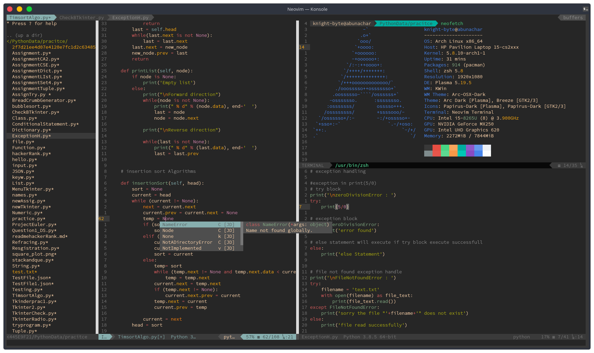
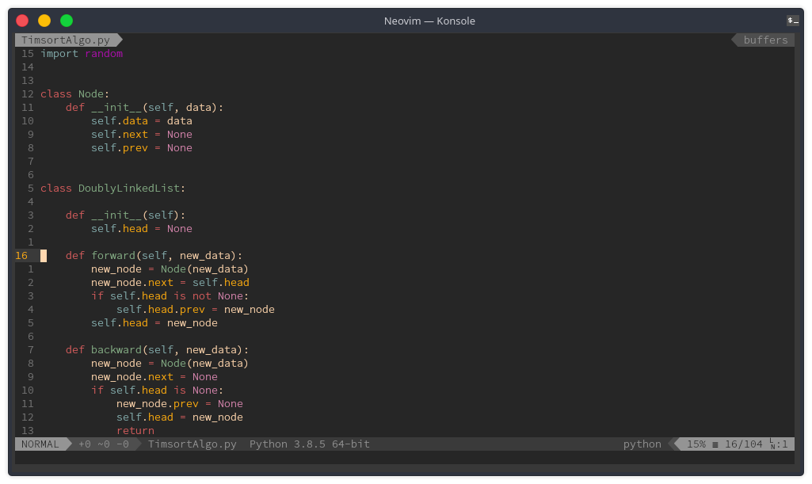
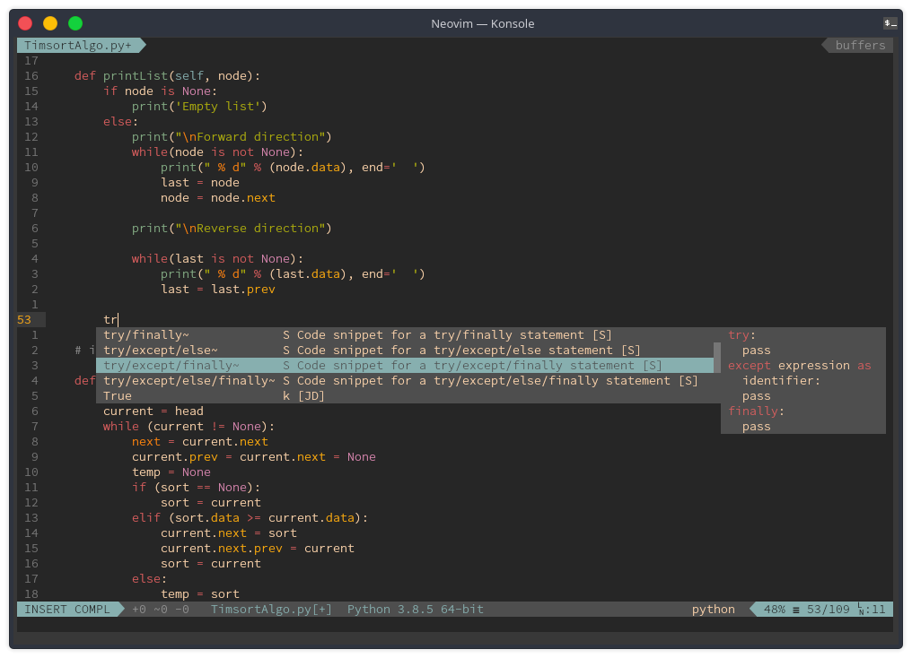
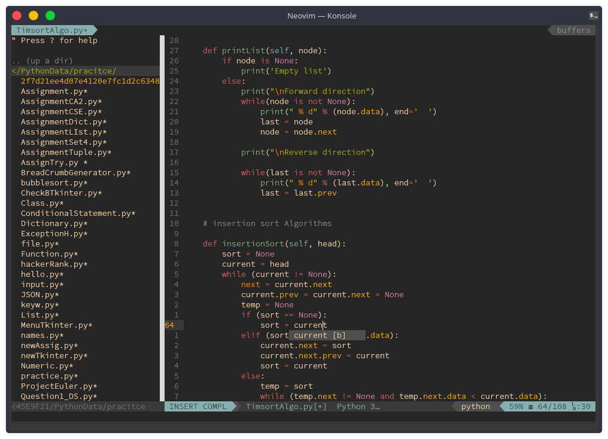

# Vim configuration for Python development
### All in one complete pack


### First Look


### Autocompletion snippets


### filemanager



## Required 
```
NVIM --- NeoVim
Vim PLugin manager
git
```

## Installation Neovim
### AppImage ("universal" Linux package)
```
curl -LO https://github.com/neovim/neovim/releases/latest/download/nvim.appimage
chmod u+x nvim.appimage
./nvim.appimage
```

### Arch linux
```
sudo pacman -S neovim
```
### Debian Based
```
sudo apt-get install neovim
```

### Gentoo Linux
```
emerge -a app-editors/neovim
```
### Fedora
```
sudo dnf install -y neovim python3-neovim
```

### for more help about Neovim visit the Official github page [NEOVIM](https://github.com/neovim/neovim)


## Main configuration of NVim

### Clone the github repository
```
git clone https://github.com/knight-byte/Vim-Configuration.git
```

### copy the init.vim and replace it with yours in ``` .config/nvim/init.vim ```
if you Dont have the ``` .config/nvim/init.vim ```
**Then make a dir and** create init.vim **in it**
```
mkdir .config/nvim  
cd .config/nvim  
touch init.vim
```
### After replacing the content of ```init.vim```
Open/Run nvim
**Then type**
```
#to update and install plugin
:PlugInstall

#to install Co-python
:CocInstall coc-python
```
